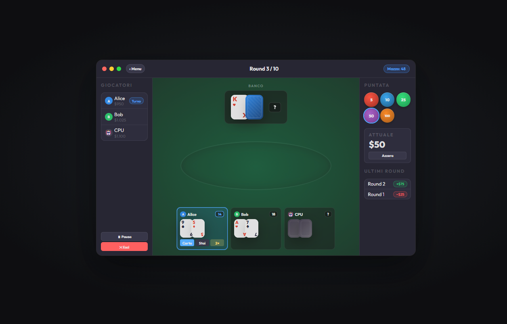
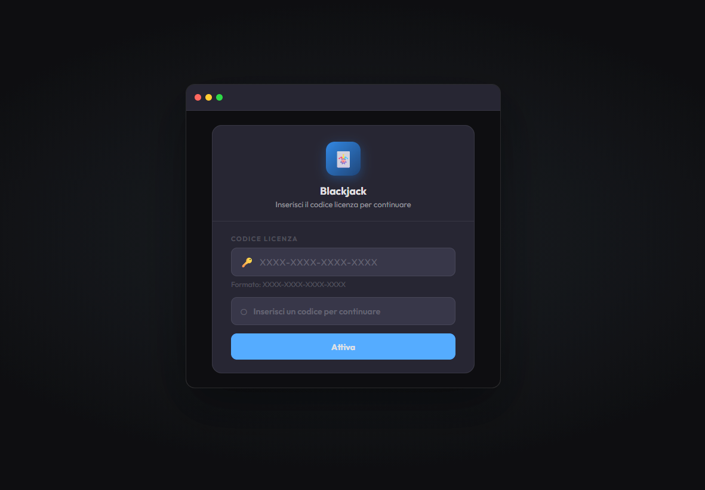
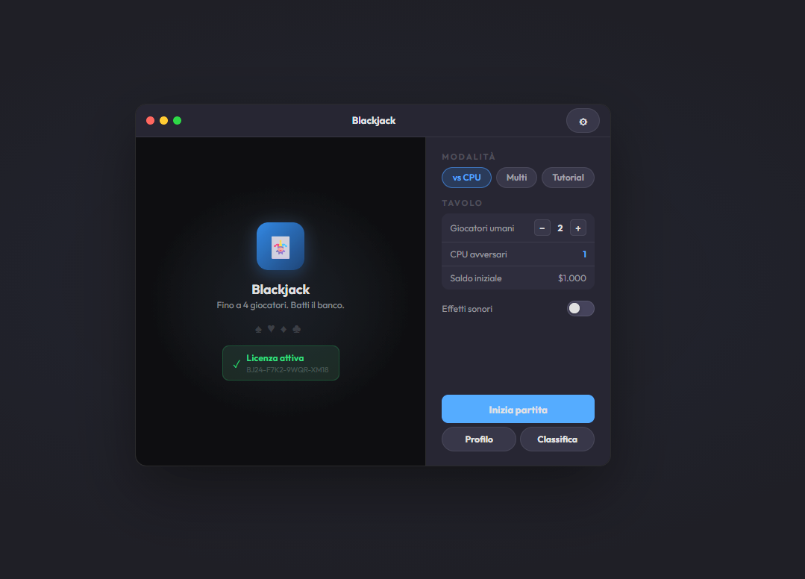
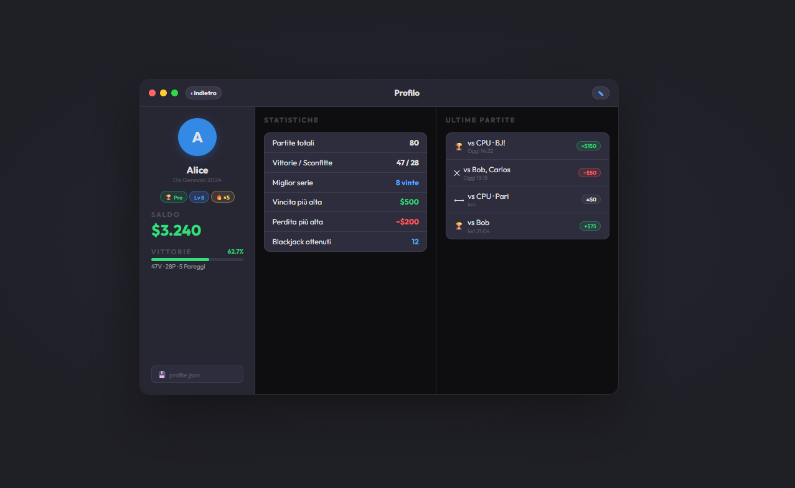
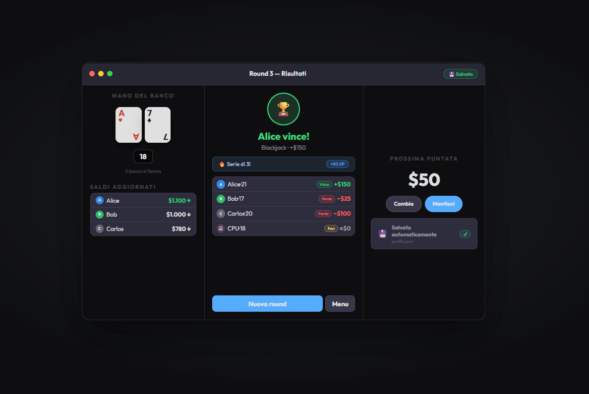

<div align="center">

# ♠️ JUST21

**Il classico gioco di carte, reinventato in Java.**


<br>



*Multiplayer locale, regole complete, interfaccia moderna.*

</div>

---

## Schermate

<table>
<tr>
<td width="50%">

### Attivazione Licenza
Inserisci la tua chiave per sbloccare il gioco completo. Licenza legata alla macchina per una protezione sicura.

</td>
<td width="50%">



</td>
</tr>
<tr>
<td width="50%">



</td>
<td width="50%">

### Lobby e Configurazione
Crea la tua partita, scegli le regole del tavolo e invita fino a 7 giocatori in locale.

</td>
</tr>
<tr>
<td width="50%">

### Tavolo da Gioco
Interfaccia intuitiva con carte animate, chip colorati e tutte le azioni a portata di click.

</td>
<td width="50%">


</td>
</tr>
<tr>
<td width="50%">



</td>
<td width="50%">

### Profilo e Statistiche
Tieni traccia delle tue performance: mani giocate, percentuale di vittoria, saldo e storico completo.

</td>
</tr>
<tr>
<td width="50%">

### Risultato Round
Riepilogo dettagliato a fine mano con payout, risultato e azioni giocate.

</td>
<td width="50%">



</td>
</tr>
</table>

---

## Funzionalità

| | Funzionalità | Dettaglio |
|---|---|---|
| **Hit / Stand** | Azioni base | Il cuore del Blackjack |
| **Split** | Fino a 4 mani | Dividi coppie, anche resplit degli assi |
| **Double Down** | Su qualsiasi mano | Anche dopo split |
| **Assicurazione** | Regole classiche | Scommessa laterale 2:1 |
| **Puntate** | 5 – 1.000 chips | Payout Blackjack naturale 3:2 |
| **Multiplayer** | Fino a 7 giocatori | Sessioni locali, turni sequenziali |
| **Salvataggio** | A fine mano | Riprendi dove hai lasciato |
| **Statistiche** | Storico completo | Mani, vincite, saldo nel tempo |
| **Lingue** | IT / EN | Cambio lingua a runtime |
| **Licenza** | Machine-bound | Validazione tramite modulo C |

---

## Tech Stack

```
┌─────────────────────────────────────────┐
│              Frontend (JavaFX)          │
│         UI · Controllers · FXML         │
├─────────────────────────────────────────┤
│              Backend (Java 21)          │
│    Game Logic · Model · Services        │
├──────────────────┬──────────────────────┤
│   Persistence    │   License Module     │
│   JSON Save/Load │   C · ProcessBuilder │
└──────────────────┴──────────────────────┘
```

---

## Quick Start

```bash
# Build
mvn clean package

# Run
mvn -pl frontend javafx:run
```

> Richiede **Java 21** e **Maven 3.9+**

---

## Team

| | Nome | Ruolo |
|---|---|---|
| [@mynameismattia](https://github.com/mynameismattia) | Mattia Alongi | Game Logic & Architecture |
| [@FeliceRossetti](https://github.com/FeliceRossetti) | Felice Rossetti | License Module & Domain Model |

<div align="center">

*Progetto per Ingegneria e Sviluppo Software 1 — SUPSI DTI*

</div>
